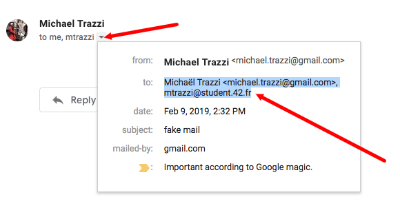
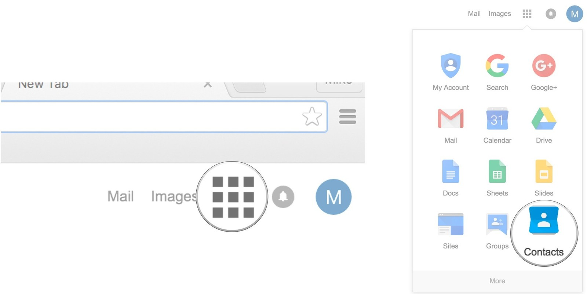
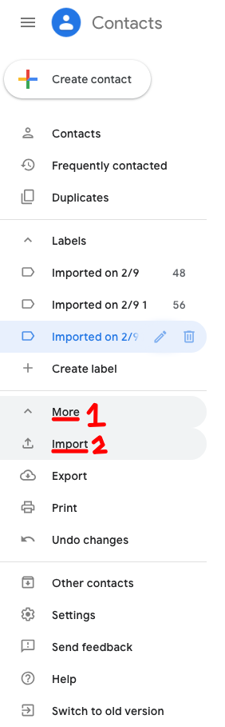
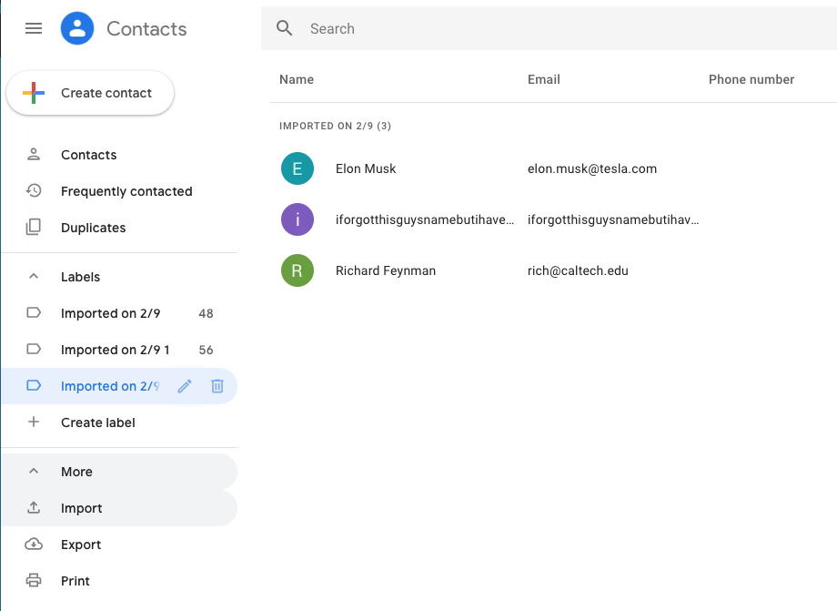

**tl;dr: I was tired of manually adding mailing lists to google contacts/LinkedIn, so I wrote a python script.**

# STEPS

#### 1) Clone the repo

```
git clone https://github.com/mtrazzi/gmail-to-google-contacts.git
```

#### 2) Change directory to the repo

```
cd gmail-to-google-contacts
```

#### 3) Edit the mail.txt file using the "first_name last_name \<mail\>" and "\<mail\>" entries from your mail client



#### 4) Run the python script

```
python script.py
```

#### 5) Open Google Contacts



#### 6) Click on "More" then "Import", and then upload the generated `google_contacts.csv` file to google contacts



#### 7) Result 🎊


